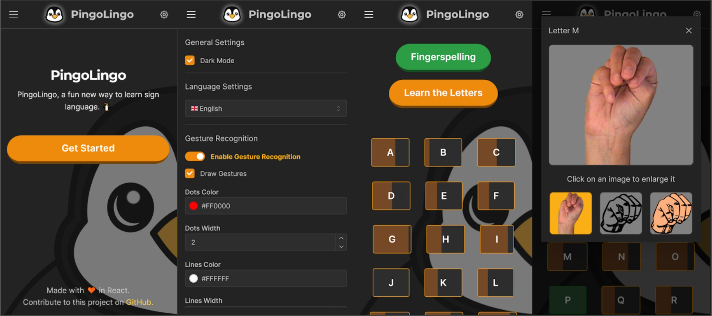

# PingoLingo

PingoLingo is a web aplication for learning the sign alphabet by leveraging machine learning and gamification techniques. The application consists of a React frontend (written in Typescript) with machine learning models based on the Mediapipe Gesture Recognition tasks. Developed as a final project for a M.D. in Computing.



## Installation

This app has been developed and tested using Node 20, older versions might work but it is not guaranteed.

First install all the dependencies using npm:

```bash
npm i
```

Then run the dev server:

```bash
npm run dev
```
